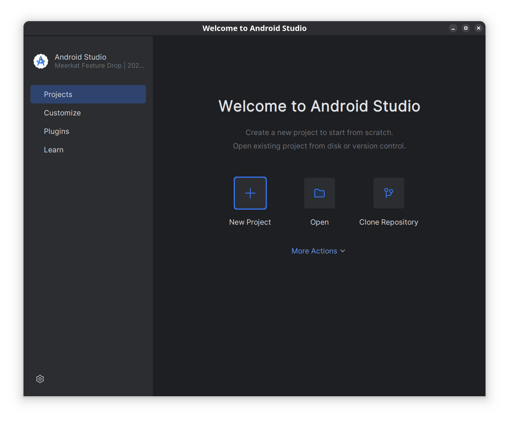

[⬅ Back](../)

# Install Android Studio on Arch Linux

Upgrade the system:

```
sudo pacman -Syu
```

Install OpenJDK:
```
sudo pacman -S jdk-openjdk
```

Set JDK version:
```
java --version
```

Should be show your version: openjdk 24.0.1 2025-04-15

Then,
```
sudo archlinux-java set java-24-openjdk
```

If you do not have yay:
```
sudo pacman -S --needed base-devel git
git clone https://aur.archlinux.org/yay.git
cd yay
makepkg -si
```

Or add chaotic-aur: [https://github.com/chaotic-aur](https://github.com/chaotic-aur)
```
sudo pacman -S yay
```

Install Android Studio from AUR:
```
yay -S android-studio
```

Finally, open Android Studio from Apps!


Select Standard Setup, accept license agreement, and finish.




