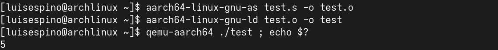

[⬅ Back](../)

# Assemble, Link, and Run AArch64 files on x86-64 with QEMU on Arch Linux

Upgrade the system:

```
sudo pacman -Syu
```

Install AArch64 Toolchain and QEMU User Mode:
```
sudo pacman -S aarch64-linux-gnu-gcc qemu-user 
```

Create an Assembly Source File:

```
nano test.s
```

Paste the following code into test.s, then save with Ctrl+S and exit with Ctrl+X::

```
.global _start

_start:
    mov x0, #5
    mov x8, #93
    svc #0

```

Assemble the File:
```
aarch64-linux-gnu-as test.s -o test.o
```

Link the Object file:
```
aarch64-linux-gnu-ld test.o -o test
```

Finally, run the Binary with QEMU:
```
qemu-aarch64 ./test ; echo $?
```

You should see 5 printed to the terminal — this is the exit code set by the mov x0, #5 instruction.


