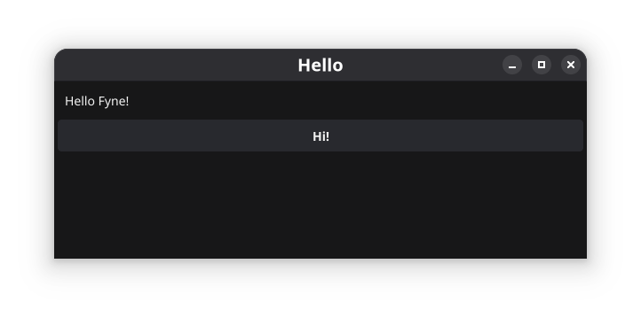

[⬅ Back](../)

# Installing Go Using Fyne.io GUI on Arch Linux 

### Installing Go

Update the system:
```
sudo pacman -Syu
```

Install Go:
```
sudo pacman -S go
```

Check the Go version:
```
go version
```

You should see output like:
go version go1.24.3 linux/amd64 (your version may vary).

Configure your shell environment:

Edit .bashrc:
```
nano ~/.bashrc
```

Add the following lines at the end of the file:
```
export GOROOT=/usr/lib/go
export GOPATH=$HOME/go
export PATH=$PATH:$GOROOT/bin:$GOPATH/bin
```

Reload the shell:
```
source ~/.bashrc
```

Restart the terminal.


### Install Fyne.io

Create a new project directory:
```
mkdir fyne-hello
cd fyne-hello
go mod init fyne-hello
```

Install the Fyne module:
```
go get fyne.io/fyne/v2@latest
```

Create main.go:
```
nano main.go
```

Paste the following code into main.go:
```
package main

import (
    "fyne.io/fyne/v2"
	"fyne.io/fyne/v2/app"
	"fyne.io/fyne/v2/container"
	"fyne.io/fyne/v2/widget"
)

func main() {
	a := app.New()
	w := a.NewWindow("Hello")

	hello := widget.NewLabel("Hello Fyne!")
	w.SetContent(container.NewVBox(
		hello,
		widget.NewButton("Hi!", func() {
			hello.SetText("Welcome :)")
		}),
	))
    w.Resize(fyne.NewSize(600, 300))
	w.ShowAndRun()
}
```

Download and tidy dependencies:
```
go mod tidy
```

Run the app:
```
go run main.go
```

The first run may take a few minutes.

