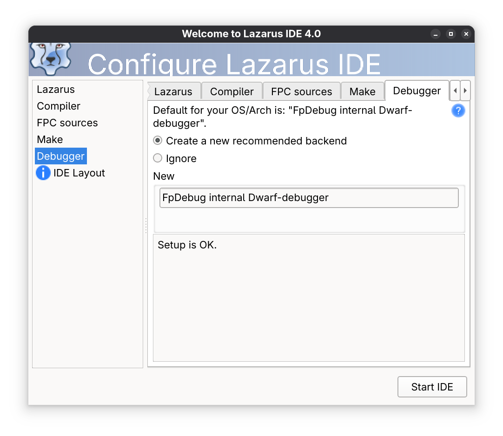
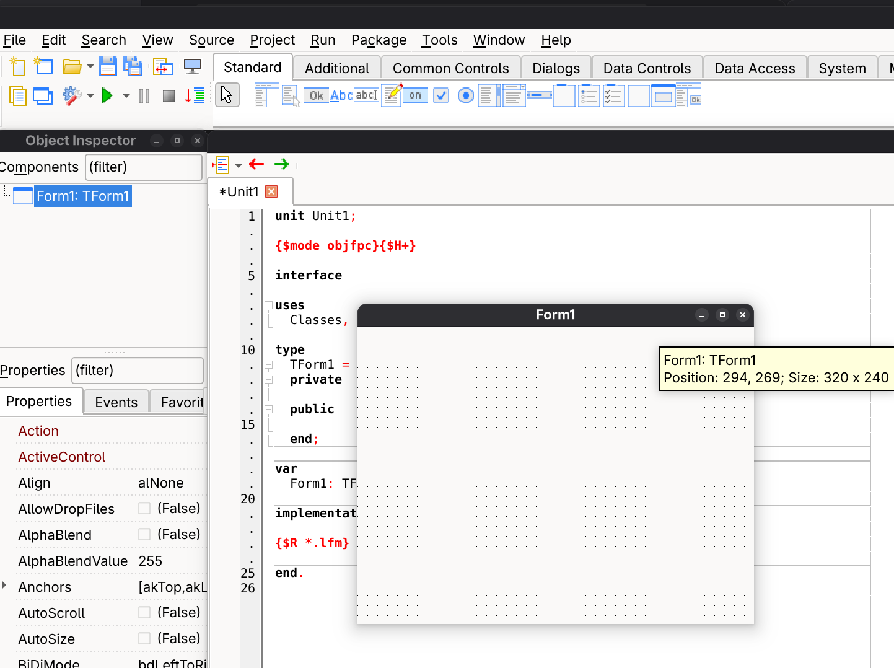

[⬅ Back](../)

# Install Lazarus on Arch Linux

Update the system:
```
sudo pacman -Syu
```

Install Lazarus and dependencies (qt6 is more compatible):
```
sudo pacman -S lazarus-qt6
```

Some dependencies are: fpc, fpc-src, gdb, lazarus and qt6pas

Execute Lazarus on console or Shorcut App:
```
lazarus
```

Configure the Backend Debugger and start IDE:


¡Happy programming!


