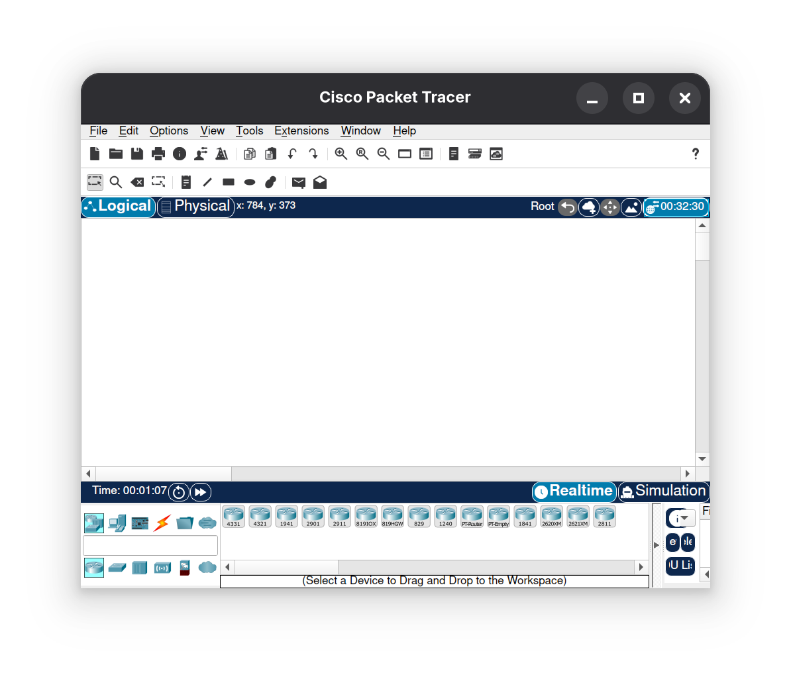

# Install Packet Tracer on Arch Linux

Update the system:
```
sudo pacman -Syu
```

Log in to the Cisco Networking Academy and download the .deb package from:
[https://www.netacad.com/resources/lab-downloads](https://www.netacad.com/resources/lab-downloads)

Click on Packet Tracer 8.2.2 Ubuntu 64-bit to start the download.

Install required dependencies (if not already installed)
```
sudo pacman -S git base-devel
```

Clone the AUR repository and enter the folder
```
git clone https://aur.archlinux.org/packettracer.git
cd packettracer
```

Copy the .deb package into the project directory
```
cp /home/luisespino/Downloads/Packet_Tracer822_amd64_signed.deb /home/luisespino/packettracer/
```

Build and install the package
```
makepkg -si
```

You can start it via the application menu ("Packet Tracer 8.2.2") or by running:
```
packettracer
```

When prompted, choose whether to enable multi-user mode.

Then, sign in using your NetAcad or Skills for All credentials.




