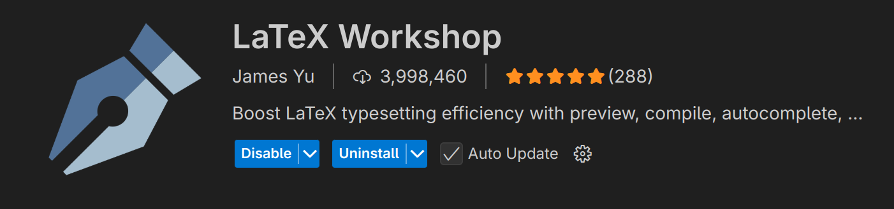
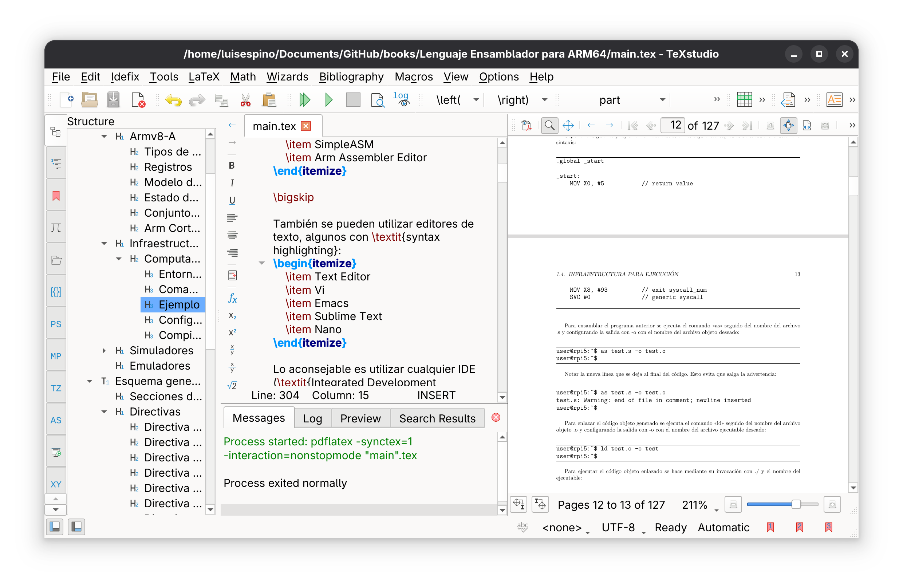

# Compiling LaTeX with TeX Live and Visual Studio Code on Arch Linux

On Linux, there are not many polished tools for editing and compiling LaTeX locally. Overleaf is a good online option, but it has its limitations. Visual Studio Code (VSCode) is a powerful alternative for writing and compiling LaTeX documents directly on your system.

Before installing packages, update your system:
```
sudo pacman -Syu
```

Install the TeX Live components you need. This selection covers most typical documents using minted, tikz, Spanish language support, advanced math, and additional fonts:
```
sudo pacman -S \
  texlive-latex \
  texlive-latexextra \
  texlive-fontsextra \
  texlive-langspanish \
  texlive-pictures \
  texlive-mathscience \
  texlive-xetex \
  texlive-metapost \
  texlive-binextra \
  python-pygments
```


More information:
[https://wiki.archlinux.org/title/TeX_Live](https://wiki.archlinux.org/title/TeX_Live)


Install the official Microsoft release of VSCode:
```
sudo pacman -S visual-studio-code-bin
```

Alternative options:
- `code`: Open-source build maintained by Arch Linux.
- `vscodium`: Fully open-source community build of VSCode.

It is highly recommended to install the LaTeX Workshop extension for compiling and previewing LaTeX files within VSCode.

You can install it from the Extensions Marketplace (Ctrl+Shift+X → search "LaTeX Workshop").



If you're looking for an interface similar to Overleaf, you can install TeXstudio:
```
sudo pacman -S texstudio
```


