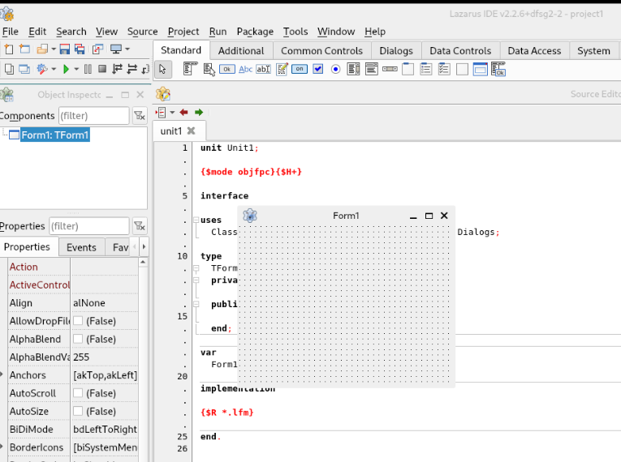

[⬅ Back](../)

# Install Lazarus on Debian/Ubuntu

Update the system:
```
sudo apt update && sudo apt upgrade -y
```

Install Lazarus and dependencies (qt5 is more compatible):
```
sudo apt install lazarus-ide-qt5
```

Some dependencies are: fpc, fpc-source, gdb, lazarus and lc-qt5

Execute Lazarus on console or Shorcut App:
```
lazarus-ide
```

¡Happy programming!


