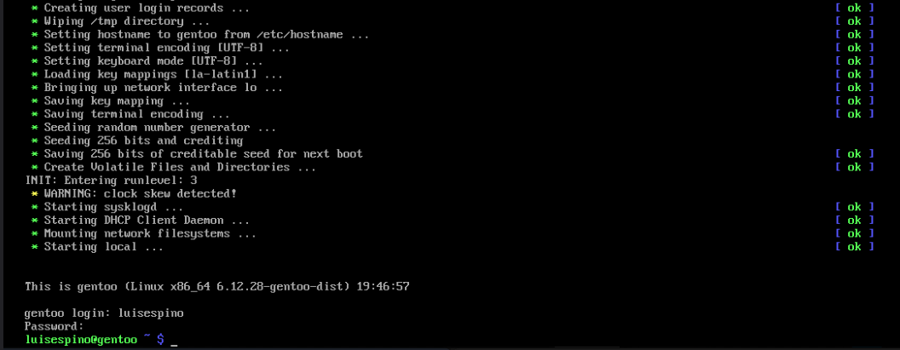

[⬅ Back](../)

# Install Gentoo

Using UEFI and OpenRC

## 1. Boot Gentoo from USB

Download the latest ISO (I use the LiveGUI USB image):

[Gentoo Downloads](https://www.gentoo.org/downloads/)

Use your preferred tool to create a bootable USB drive.

Boot from the USB. In the GUI, you can configure the keyboard, network, etc. Then, open a terminal.

## 2. Prepare the disks

### Create a GPT Partition Table

Use fdisk on the correct device:
```
fdisk /dev/sda
```

- Press g to create a new GPT disk label.
- Press d to delete existing partitions (if any).
- Create partitions in the following order:

EFI System Partition

- Press n, choose partition 1, size e.g., +1G
- If prompted, remove any existing signature
- Press t, choose partition 1, type 1 (EFI System)

Swap Partition

- Press n, choose partition 2, size e.g., +4G
- Press t, choose partition 2, type 19 (Linux swap)

Root Partition

- Press n, choose partition 3, accept default size to use remaining space
- Press t, choose partition 3, type 23 (Linux root x86-64)

Press w to write and exit.

### Format the partitions


```
mkfs.fat -F32 /dev/sda1
mkswap /dev/sda2
mkfs.xfs /dev/sda3
```

### Mount the partitions

Create the directories:
```
mkdir -p /mnt/gentoo
mkdir -p /mnt/gentoo/efi
swapon /dev/sda2
mount /dev/sda3 /mnt/gentoo
mount /dev/sda1 /mnt/gentoo/efi
```

## 3. Configure the Stage 3

#### Download the Stage 3 file

Change to the working directory:
```
cd /mnt/gentoo
```

Sync the time:
```
chronyd -q
```

Use links or wget to download the stage tarball:
```
links https://www.gentoo.org/downloads/mirrors/
```

Choose a stage 3 tarball. For example:

[Stage 3 desktop profile with OpenRC](https://distfiles.gentoo.org/releases/amd64/autobuilds/20250511T165428Z/stage3-amd64-desktop-openrc-20250511T165428Z.tar.xz)

### Extract the Stage 3
```
tar xpvf stage3-amd64-desktop-openrc-20250511T165428Z.tar.xz --xattrs-include='*.*' --numeric-owner -C /mnt/gentoo
```

Edit make.conf file:
```
nano /mnt/gentoo/etc/portage/make.conf
```

Example flags:
```
COMMON_FLAGS="-O2 -march=x86-64 -pipe"

CFLAGS="${COMMON_FLAGS}"
CXXFLAGS="${COMMON_FLAGS}"

MAKEOPTS="-j4 -l8"
```

## 4. Install the kernel

### Prepare the Environment

```
cp --dereference /etc/resolv.conf /mnt/gentoo/etc/
mount --types proc /proc /mnt/gentoo/proc
mount --rbind /sys /mnt/gentoo/sys
mount --make-rslave /mnt/gentoo/sys
mount --rbind /dev /mnt/gentoo/dev
mount --make-rslave /mnt/gentoo/dev
mount --bind /run /mnt/gentoo/run
mount --make-slave /mnt/gentoo/run
```

Enter to the new environment:
```
chroot /mnt/gentoo /bin/bash
source /etc/profile
export PS1="(chroot) ${PS1}"
```

Sync and Set Profile (e.g. 3 for gnome)
```
emerge-webrsync
eselect profile list
eselect profile set 3
```

Set Timezone
```
ls -l /usr/share/zoneinfo
ln -sf ../usr/share/zoneinfo/America/Guatemala /etc/localtime
```

Uncomment the UTF-8 locale:
```
nano /etc/locale.gen
```

Set locale:
```
locale-gen
eselect locale list
eselect locale set 2
```

Reload the environment:
```
env-update && source /etc/profile && export PS1="(chroot) ${PS1}"
```

### Enable GRUB Support

```
echo "sys-kernel/installkernel grub" >> /etc/portage/package.use/installkernel
emerge --ask sys-kernel/installkernel
echo "sys-kernel/installkernel dracut" >> /etc/portage/package.use/installkernel
emerge --ask sys-kernel/installkernel
```

### Install a distribution kernel

Emerge a precompiled kernel instead use the kernel-sources and clean up:
```
emerge --ask sys-kernel/gentoo-kernel-bin
emerge --depclean
```

Edit make.conf and ensure:
```
echo 'USE="dist-kernel"' >> /etc/portage/make.conf
```

### Configure /etc/fstab

Use blkid to get PARTUUID values, then:
```
nano /etc/fstab
```

Example entries:
```
PARTUUID=c12a7328-f81f-11d2-ba4b-00a0c93ec93b   /efi        vfat    umask=0077,tz=UTC            0 2
PARTUUID=0657fd6d-a4ab-43c4-84e5-0933c84b4f4f   none            sw                           0 0
PARTUUID=44479540-f297-41b2-9af7-d131d5f0458a   /           xfs    defaults,noatime              0 1
```
### Network & Basic Setup

Set the hostname:
```
echo gentoo > /etc/hostname
```

Configure DHCP:
```
emerge --ask net-misc/dhcpcd
rc-update add dhcpcd default
rc-service dhcpcd start
systemctl enable dhcpcd
```

Edit the hosts file:
```
nano /etc/hosts
```

Check the following lines:
```
# This defines the current system and must be set
127.0.0.1     gentoo.localdomain gentoo localhost
::1           gentoo.localdomain gentoo localhost
```

Set the root password:
```
passwd
```

Configure OpenRC, keymaps and hwclock:
```
nano /etc/rc.confnano /etc/rc.conf
nano /etc/conf.d/keymaps
nano /etc/conf.d/hwclock
```

Install system logger:
```
emerge --ask app-admin/sysklogd
rc-update add sysklogd default
```

## 5. Configure the Bootloader (GRUB)

Add efi configuration to make.conf file:
```
echo 'GRUB_PLATFORMS="efi-64"' >> /etc/portage/make.conf
```

Download the Grub package:
```
emerge --ask sys-boot/grub
```

Install Grub:
```
grub-install --efi-directory=/efi
```

Configure Grub:
```
grub-mkconfig -o /boot/grub/grub.cfg
```
Check for vmlinuz and initramfs in /boot.

Exit chroot and reboot:
```
exit
umount -l /mnt/gentoo/dev{/shm,/pts,}
umount -l /mnt/gentoo
umount -l /mtn/gentoo/efi
reboot
```

## 6. User management

Create a new user:
```
useradd -m -G users,wheel,audio,video -s /bin/bash luisespino
```

Set user password:
```
passwd luisespino
```

Install sudo package:
```
emerge --ask app-admin/sudo
```

Edit sudo configuration:
```
visudo
```

Uncomment the line:
```
%wheel ALL=(ALL:ALL) ALL
```





